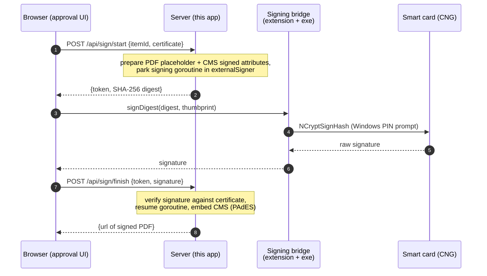
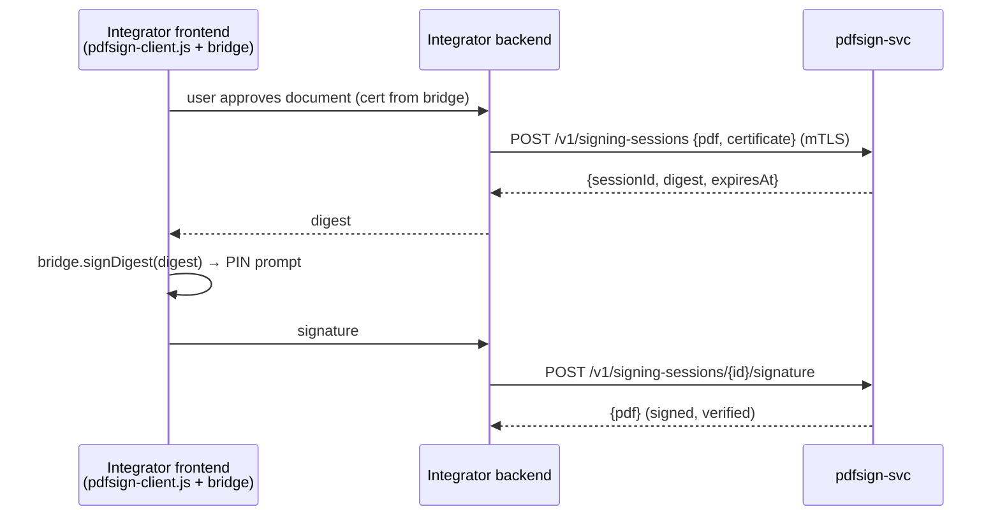
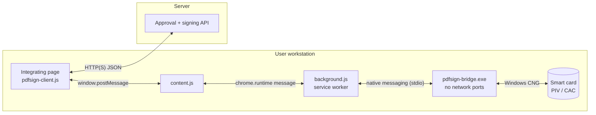

# pdf-sign

[](https://github.com/192d-Wing/pdf-sign/actions/workflows/ci.yml)
[](https://github.com/192d-Wing/pdf-sign/actions/workflows/devsecops.yml)
[](https://github.com/192d-Wing/pdf-sign/releases/latest)
[](https://github.com/192d-Wing/pdf-sign/releases)
[](https://pkg.go.dev/github.com/192d-wing/pdf-sign)
[](go.mod)
[](LICENSE)

Web-based PDF approval queue with smart-card digital signatures — no Adobe
required. Go end-to-end, built on
[digitorus/pdfsign](https://github.com/digitorus/pdfsign).

## How it works (deferred / remote-hash signing)

Browsers cannot talk to smart cards, so the design splits the work: the
server does all PDF work, the workstation signs one digest. The whole PDF
never leaves the server; only a 32-byte digest travels to the card and a
~256-byte signature comes back.



## Repo layout — the reusable pieces

```
internal/signing/            deferred-signing engine (Go package: Prepare / Complete / Cancel)
cmd/pdf-sign/                demo approval app — the *reference integrator*
cmd/pdf-sign/web/pdfsign-client.js   browser SDK: the only code that touches the bridge
cmd/pdfsign-svc/             standalone signing API service for other websites
bridge/                      browser extension + native host (workstation side)
```

Another website adds smart-card signing by copying `pdfsign-client.js`
into its frontend and having its backend either import
`internal/signing` (Go) or call `pdfsign-svc` (any language). The bridge
is shared; only its allowed origins need updating.

Key pieces of the demo app:

- `internal/signing` — `externalSigner` implements `crypto.Signer` without
  a key: `Sign()` publishes the digest and blocks until the caller delivers
  the card's signature. Sessions are owner-scoped, quota-limited, verified
  before embedding, and garbage-collected on expiry.
- `cmd/pdf-sign/handlers.go` — `POST /api/sign/start` (returns
  `{token, digest}`), `POST /api/sign/finish` (returns `{url}`),
  `GET /api/verify`.
- `cmd/pdf-sign/democard.go` — a software RSA key + self-signed cert
  simulating the card so the flow runs without hardware (behind `-demo`).
- `cmd/pdf-sign/web/pdfsign-client.js` — the SDK:
  `detectBridge()`, `getCertificate()`, `signDigest(digestB64, thumbprint)`.

## Run the demo app

```
go run ./cmd/pdf-sign -demo     # development: enables the demo card (test key)
```

Open http://127.0.0.1:8080 — two sample pending PDFs are generated on first
run (`data/pending/`). Click **Review** to see the document, **Approve &
sign**, then **Verify** on the result. Signed files land in `data/signed/`.

Production mode (no demo oracle; signing certs must chain to your CAs):

```
go run ./cmd/pdf-sign -sign-ca dod-roots.pem \
         -tls-cert server.crt -tls-key server.key \
         -client-ca dod-roots.pem     # optional: mTLS smart-card login
```

With `-client-ca`, users authenticate with their card's TLS client cert and
may only sign with a certificate whose subject CN matches their own.

## Signing service for other websites (cmd/pdfsign-svc)

A standalone multi-tenant API so any backend (any language) can add
smart-card PDF signing without touching PDF or CMS internals. Browsers
never call it directly — the integrating website's backend proxies, applies
its own user authorization, and holds the API relationship.

**Integrating another system?** See the step-by-step
[docs/integration-guide.md](docs/integration-guide.md) — frontend SDK usage,
backend proxy examples (Node and Python), the full API reference, and an
integration checklist.



| Endpoint | Body | Returns |
|---|---|---|
| `POST /v1/signing-sessions` | `{pdf, certificate, name?, reason?, location?}` (base64) | `201 {sessionId, digest, expiresAt}` |
| `POST /v1/signing-sessions/{id}/signature` | `{signature}` | `200 {pdf}` (signed, base64) |
| `DELETE /v1/signing-sessions/{id}` | — | `204` |

Authentication — two mutually exclusive modes:

- **Production (default): mutual TLS.**
  ```
  go run ./cmd/pdfsign-svc -sign-ca roots.pem \
      -tls-cert server.crt -tls-key server.key -client-ca tenants.pem
  ```
  Every caller must present a client certificate issued by `-client-ca`;
  the tenant identity is the client cert CN. Sessions are tenant-scoped:
  only the tenant that created a session can complete or cancel it.
  Requests without a client certificate fail in the TLS handshake —
  bearer tokens are not accepted in this mode.
- **Development only: bearer token.**
  ```
  go run ./cmd/pdfsign-svc -dev        # plain HTTP; token printed at startup
  ```
  Token comes from `PDFSIGN_DEV_TOKEN` or is generated. `-dev` refuses to
  combine with `-client-ca`.

The service holds documents in memory only for the session TTL (5 min),
validates signing certs against `-sign-ca`, verifies every returned
signature before embedding, and caps concurrent sessions per tenant
(`-max-sessions`, default 32).

## Smart card bridge (bridge/)

A browser extension + native-messaging host that signs with a real card via
Windows CNG. The web app auto-detects it and falls back to demo mode. See
[docs/client_design.md](docs/client_design.md) for the full protocol and
security model of the client side,
[docs/deployment.md](docs/deployment.md) for rolling all of this out, and
[docs/nist-800-53-mapping.md](docs/nist-800-53-mapping.md) for the NIST
800-53 Rev 5 control matrix (ATO artifacts; code is annotated with
`NIST 800-53r5` comments at each enforcing function).



- `bridge/host/` — Go native-messaging host. `listCertificates` enumerates
  the user's MY store (smart-card certs appear there via the minidriver),
  filters to time-valid signing certs with a CNG key, and puts the best
  candidate first (PIV/CAC *signature* cert with the non-repudiation bit
  beats the authentication cert). `signDigest` calls `NCryptSignHash` —
  Windows shows the PIN prompt. RSA (PKCS#1 v1.5) and ECDSA (DER) keys are
  both supported. Debug with `pdfsign-bridge.exe -cli list`.
- `bridge/extension/` — Manifest V3 extension that relays
  `window.postMessage` requests from the page to the host.

### Install (per user)

1. Open `chrome://extensions` (or `edge://extensions`), enable Developer
   mode, **Load unpacked** → select `bridge/extension`, copy the extension
   ID.
2. Run `bridge\host\install.ps1 -ExtensionId <id>` — builds the exe into
   `%LOCALAPPDATA%\pdf-sign-bridge` and registers it for Chrome and Edge
   (HKCU, no admin needed).
3. Reload http://127.0.0.1:8080 — the banner turns green ("Smart card
   bridge connected"). Signing now reads your card and prompts for a PIN.

For fleet deployment, package the extension in the Web Store (or force-install
via the `ExtensionInstallForcelist` policy) and push the host + registry keys
with GPO/Intune.

## Going to production

1. **Bridge hardening:** pin the production extension ID in
   `allowed_origins`, code-sign `pdfsign-bridge.exe`, and if users have
   multiple valid certs add a cert-picker UI instead of taking the host's
   first candidate. Remove the `/api/demo-card/*` endpoints and
   `demoBridge`.
2. **Certificate validation:** done — run with `-sign-ca` (mandatory
   outside `-demo`). Signature bytes returned by the bridge are verified
   against the submitted certificate before embedding.
3. **Auth & transport:** run with `-tls-cert`/`-tls-key` for HTTPS and
   `-client-ca` for smart-card mTLS login; the signing cert must then
   belong to the authenticated user. If you front this with an SSO proxy
   instead, tie the approval queue to the proxy identity.
4. **Trusted timestamps (PAdES-T):** set `SignData.TSA.URL` to an RFC 3161
   TSA so signatures outlive certificate expiry.
5. **State & scale:** sessions are in-memory; behind a load balancer use
   sticky sessions or persist the prepared-PDF state keyed by token.
6. **Blind-signing posture:** users can **Review** the exact pending PDF,
   and a CSP blocks injected scripts on the approval page — but the card
   still signs a digest it cannot display. Keep the server trustworthy:
   it is part of the signing TCB.

## License

Licensed under the Apache License, Version 2.0. See [LICENSE](LICENSE) for the full text.
