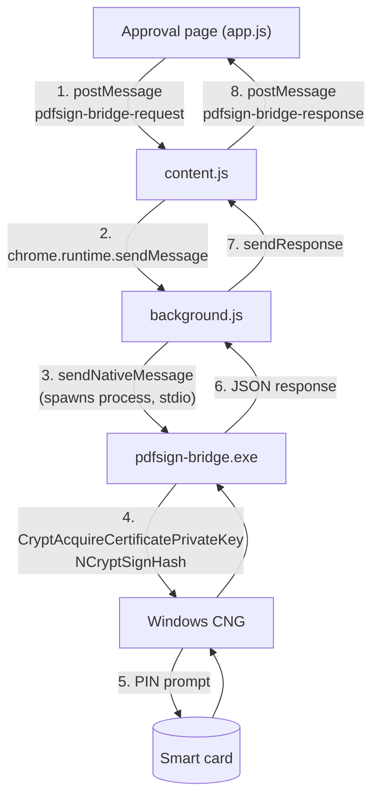
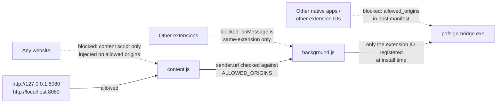

# Client design: browser extension + native host

This document describes the workstation half of pdf-sign — the browser
extension (`bridge/extension/`) and the native-messaging host
(`bridge/host/`, built as `pdfsign-bridge.exe`) — how they interact, and
the security model that governs them. For the server half and the overall
signing flow, see the [README](../README.md); for rollout, see the
[deployment guide](deployment.md).

## Components

| Component | File(s) | Runs as | Job |
|---|---|---|---|
| Browser SDK | `cmd/pdf-sign/web/pdfsign-client.js` (copy into any integrating site) | Page JavaScript (ES module) | Encapsulates the bridge protocol: `detectBridge()`, `getCertificate()`, `signDigest()` |
| Approval page | `cmd/pdf-sign/web/app.js` (reference integrator) | Page JavaScript | Drives the flow through the SDK; talks to its own backend for sessions |
| Content script | `bridge/extension/content.js` | Extension, injected into allowed origins at `document_start` | Relays page requests to the service worker and responses back |
| Service worker | `bridge/extension/background.js` | Extension background (Manifest V3) | Validates the sender, forwards one message to the native host, returns its one response |
| Native host | `bridge/host/*.go` → `pdfsign-bridge.exe` | Short-lived process spawned by the browser | Enumerates signing certificates and signs digests via Windows CNG |
| Smart card | PIV/CAC + Windows minidriver | Hardware | Holds the private key; enforces the PIN |



## Message protocol

### Page ⇄ content script (`window.postMessage`)

```
request:  { type: "pdfsign-bridge-request",  id, cmd, payload }
response: { type: "pdfsign-bridge-response", id, response }
```

`id` is a page-local sequence number used to correlate responses; the SDK
enforces a per-command timeout (1.5 s for `ping`, 120 s for `signDigest`
to allow for the PIN prompt). Integrating sites should not speak this
protocol directly — import `pdfsign-client.js` instead, so protocol
changes stay contained in one file.

### Extension ⇄ native host (Chrome native messaging)

Each message is a 4-byte little-endian length prefix followed by JSON, on
stdin/stdout. `chrome.runtime.sendNativeMessage` spawns a **fresh host
process per request**, sends one message, reads one response, and the
process exits. The host is therefore completely stateless — the cert
thumbprint is passed on every `signDigest` call.

### Commands

| Command | Request fields | Response | Notes |
|---|---|---|---|
| `ping` | — | `{ok, version}` | Used by the page to detect the bridge |
| `listCertificates` | — | `{certificates: [{subject, issuer, notAfter, thumbprint, certificate, warning?}]}` | `certificate` is base64 DER; best signing candidate first |
| `signDigest` | `thumbprint`, `digest` (base64, 32-byte SHA-256) | `{signature}` | PKCS#1 v1.5 for RSA, ASN.1 DER for ECDSA |
| any (error) | — | `{error: "..."}` | e.g. "wrong PIN", "PIN entry was cancelled" |

## Certificate selection

`listCertificates` scans the current user's `MY` store (smart-card certs
appear there automatically via the card's minidriver) and:

1. **Filters out**: CA certs, expired/not-yet-valid certs, certs whose key
   usage forbids digital signatures, TLS-server-only certs (e.g. localhost
   dev certs), and certs without an accessible CNG private key (checked
   silently — no PIN prompt).
2. **Ranks** the remainder: non-repudiation (ContentCommitment) key usage
   +2, document-signing EKU +2, email-protection EKU +1. On a PIV/CAC this
   puts the *signature* certificate above the *authentication* certificate.
3. **Warns** (per entry, surfaced in the UI after signing): missing
   non-repudiation bit, or expiry within 14 days.

The page uses the first entry. A future cert-picker UI can present the
whole list; the protocol already supports it because `signDigest` takes an
explicit thumbprint.

## Security model

### No network exposure

`pdfsign-bridge.exe` opens **no sockets** — its only I/O is the stdio pipe
its parent browser created, plus Windows crypto APIs. There is no port to
scan, no localhost listener for other processes or websites to probe, and
no TLS-on-localhost certificate problem. This is the main reason native
messaging was chosen over local-listener bridges (NexU-style).

The process also only lives for a single request, so there is no resident
attack surface between signings.

### Chain of custody — who can invoke what



Each hop is independently restricted:

1. **Page → content script.** The content script is injected only on the
   origins in `manifest.json` (`matches`). It ignores messages whose
   `event.source` is not the top window, so iframes on the page cannot
   reach it.
2. **Content script → service worker.** `chrome.runtime.onMessage` only
   receives messages from this extension's own scripts. `background.js`
   additionally rejects senders whose `sender.url` is outside
   `ALLOWED_ORIGINS` — defense in depth if `matches` is ever broadened.
3. **Service worker → host.** The browser will only spawn the host for the
   extension ID(s) listed in `allowed_origins` of the registered host
   manifest (`com.pdfsign.bridge.json`). Registration is per-user (HKCU),
   no admin rights involved.
4. **Host → key.** The private key never leaves the card. The host only
   ever obtains a key *handle*; the card performs the signature internally
   and enforces its PIN policy.

### What a compromised page could do (and not do)

The realistic attack surface is script injection (XSS) on the approval
page, because any JavaScript running on an allowed origin may post bridge
requests. Mitigations, in layers:

- The server sends a strict `Content-Security-Policy`
  (`default-src 'self'`, no inline scripts), so injected inline script does
  not execute.
- Every signature requires the card, and the card requires a PIN. Windows
  or the minidriver may cache the PIN for a short window after first use —
  during that window an injected script could request additional silent
  signatures. PIN-cache behavior is card/minidriver policy, not
  controllable from this code.
- The server independently verifies every returned signature against the
  certificate from `sign/start` and (in production mode) validates that
  certificate's chain against `-sign-ca`, so a page cannot make the server
  publish a document signed by an unapproved identity.

What no page can do, compromised or not: read the PIN, extract the private
key, or reach the host without going through the extension hops above.

### Blind signing (inherent limitation)

The card signs a 32-byte digest it cannot display. The user's assurance
that the digest corresponds to the document they reviewed comes from
trusting the server that computed it — the server is part of the trusted
computing base. The **Review** link exists so the user sees the exact
pending bytes the server will digest. Every commercial remote-signing
product shares this trade-off; eliminating it requires trusted-display
signature hardware.

### Failure behavior

- Card errors map to friendly messages in the host (`wrong PIN`,
  `PIN entry was cancelled`, `card PIN is blocked`,
  `smart card was removed`); anything else surfaces as a raw
  `0x…` status code for debugging.
- If the extension or host is missing, the page falls back to demo mode
  only when the server runs with `-demo`; otherwise it reports that no
  signing bridge is available. Signing never silently downgrades from card
  to test key: the demo card lives on the server and its endpoints do not
  exist outside `-demo`.

## Installation and registration

Development (per user, no admin):

1. Load `bridge/extension` unpacked (`chrome://extensions` /
   `edge://extensions`, Developer mode) and copy the extension ID.
2. `bridge\host\install.ps1 -ExtensionId <id>` — builds the exe into
   `%LOCALAPPDATA%\pdf-sign-bridge\`, writes the host manifest next to it
   (UTF-8 **without BOM** — Chrome rejects a BOM), and registers
   `HKCU\Software\{Google\Chrome,Microsoft\Edge}\NativeMessagingHosts\com.pdfsign.bridge`.

Production fleet:

- Publish the extension (Web Store or self-hosted CRX) and force-install it
  via the `ExtensionInstallForcelist` policy; pin that production extension
  ID in `allowed_origins`.
- Code-sign `pdfsign-bridge.exe`; push the exe, manifest, and registry keys
  with GPO/Intune. Everything is per-user (HKCU) but can equally be
  registered under HKLM for all users.
- Update the extension `matches` / `background.js` `ALLOWED_ORIGINS` and
  the server URL to the production origin (HTTPS).

## Debugging

```
pdfsign-bridge.exe -cli ping    # host runs and responds
pdfsign-bridge.exe -cli list    # certificate enumeration, no PIN needed
```

`-cli` bypasses the length-prefixed framing and prints JSON, so the CNG
logic can be tested without a browser. Signature failures end-to-end are
easiest to triage from the extension's service-worker console
(`chrome://extensions` → the extension → *Inspect views: service worker*),
which shows `chrome.runtime.lastError` when the host manifest or registry
registration is wrong.
