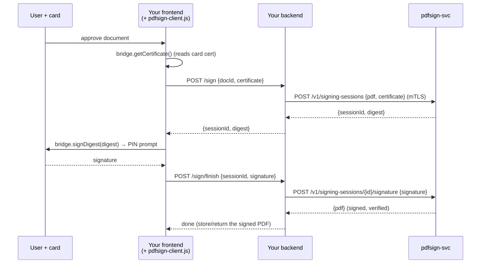

# Integration guide

How to add smart-card PDF signing to your own web application using
`pdfsign-svc`. Your users approve a document in your UI, sign it with their
PIV/CAC card, and your backend receives a signed PAdES PDF — no Adobe, no
PDF/CMS code on your side.

Audience: developers integrating an existing web app (any language on the
backend, any framework on the frontend). For the internals see
[client_design.md](client_design.md) (bridge protocol) and
[deployment.md](deployment.md) (running the service).

---

## 1. What you build vs. what you get



**You provide:**
- **Frontend**: import `pdfsign-client.js`, call three methods, POST to your
  own backend.
- **Backend**: two thin routes that proxy to `pdfsign-svc` over mTLS and
  apply *your* authorization ("is this user allowed to sign this doc?").
- **Document storage & workflow**: your approval queue, your database.

**You get from this project:**
- `pdfsign-svc` — the signing engine (deploy it, or a central team runs it).
- `pdfsign-client.js` — the browser SDK (copy one file).
- The bridge — a browser extension + native host on each workstation
  (deployed once per machine; see [deployment.md](deployment.md) §4).

**Golden rule: browsers never call `pdfsign-svc` directly.** Your backend
proxies. This keeps the service's mTLS credential server-side, lets you
enforce your own access control, and avoids CORS entirely.

---

## 2. Prerequisites

1. **A running `pdfsign-svc`** reachable from your backend (not your users).
   Get its base URL from whoever operates it.
2. **A tenant client certificate** issued by the service's `-client-ca`.
   This is *your application's* identity (the CN becomes your tenant id in
   the service's audit log). Store the cert + key as a server-side secret.
3. **The bridge installed** on user workstations, with **your web origin
   added to its allowlist** — the extension only talks to pages on origins
   listed in `manifest.json` (`content_scripts.matches`) and
   `background.js` (`ALLOWED_ORIGINS`). Coordinate this with whoever
   packages the extension for your fleet.

For local development you can run the service in dev mode (bearer token, no
mTLS) — see §7.

---

## 3. Frontend integration

Copy [`pdfsign-client.js`](../cmd/pdf-sign/web/pdfsign-client.js) into your
app and import it. It encapsulates the postMessage protocol with the bridge.

### SDK surface

```js
import { detectBridge } from './pdfsign-client.js';

const bridge = await detectBridge();   // null if the extension isn't installed
if (!bridge) {
  // Tell the user to install the bridge (link to your install docs).
  return;
}

// Best signing certificate on the card (non-repudiation cert preferred).
// warning is a human-readable string, e.g. "certificate expires 2026-07-08".
const { certificate, thumbprint, warning } = await bridge.getCertificate();

// digestB64 comes from your backend (see below). Windows shows the PIN
// prompt here. Returns a base64 signature (PKCS#1 v1.5 for RSA, DER ECDSA).
const signature = await bridge.signDigest(digestB64, thumbprint);
```

`bridge.listCertificates()` returns the full list if you want to show a
cert picker instead of taking the best one.

### End-to-end flow

```js
async function signDocument(docId) {
  const bridge = await detectBridge();
  if (!bridge) throw new Error('Smart card bridge not installed');

  const { certificate, thumbprint, warning } = await bridge.getCertificate();
  if (warning) showNotice(warning); // e.g. cert expiring soon

  // 1) Ask YOUR backend to prepare the signature.
  const start = await fetch('/api/sign/start', {
    method: 'POST',
    headers: { 'Content-Type': 'application/json' },
    body: JSON.stringify({ docId, certificate }),
  }).then(r => r.json());

  // 2) Card signs the digest (PIN prompt).
  const signature = await bridge.signDigest(start.digest, thumbprint);

  // 3) Hand the signature back to YOUR backend to finish.
  await fetch('/api/sign/finish', {
    method: 'POST',
    headers: { 'Content-Type': 'application/json' },
    body: JSON.stringify({ sessionId: start.sessionId, signature }),
  });

  // Signed PDF is now stored by your backend.
}
```

The document bytes never touch the browser — only the 32-byte digest and
the signature do.

---

## 4. Backend integration

Your backend does three things per signature: **authorize**, **proxy to
`pdfsign-svc` over mTLS**, and **persist the result**. Two routes:

### `POST /api/sign/start`

1. Authenticate the user (your existing session/SSO).
2. **Authorize**: confirm this user may sign this `docId`. *(This is the
   check the service cannot do for you.)*
3. Load the document bytes from your store.
4. Call `POST /v1/signing-sessions` with the PDF + the client's certificate.
5. Return `{ sessionId, digest }` to the frontend. (Keep your own mapping
   of `sessionId → docId, userId` if you need it at finish time.)

### `POST /api/sign/finish`

1. Re-authorize (same user, same session).
2. Call `POST /v1/signing-sessions/{sessionId}/signature`.
3. Store the returned signed PDF; advance your workflow.

### Node.js (Express) example

```js
import express from 'express';
import { Agent } from 'undici';
import { readFileSync } from 'node:fs';

// mTLS client credential for pdfsign-svc (your tenant identity).
const svcAgent = new Agent({
  connect: {
    cert: readFileSync(process.env.PDFSIGN_CLIENT_CERT),
    key: readFileSync(process.env.PDFSIGN_CLIENT_KEY),
    ca: readFileSync(process.env.PDFSIGN_SERVER_CA),
  },
});
const SVC = process.env.PDFSIGN_SVC_URL; // e.g. https://sign.internal:8443

const app = express();
app.use(express.json({ limit: '32mb' }));

app.post('/api/sign/start', async (req, res) => {
  const { docId, certificate } = req.body;
  if (!(await userMaySign(req.user, docId)))        // YOUR authorization
    return res.status(403).json({ error: 'not authorized' });

  const pdf = await loadPdf(docId);                 // YOUR storage
  const r = await fetch(`${SVC}/v1/signing-sessions`, {
    method: 'POST',
    headers: { 'Content-Type': 'application/json' },
    body: JSON.stringify({
      pdf: pdf.toString('base64'),
      certificate,
      reason: `Approved by ${req.user.name}`,
    }),
    dispatcher: svcAgent,
  });
  if (!r.ok) return res.status(502).json(await r.json());
  const { sessionId, digest } = await r.json();
  await rememberSession(sessionId, { docId, userId: req.user.id });
  res.json({ sessionId, digest });
});

app.post('/api/sign/finish', async (req, res) => {
  const { sessionId, signature } = req.body;
  const ctx = await lookupSession(sessionId);
  if (!ctx || ctx.userId !== req.user.id)
    return res.status(403).json({ error: 'not authorized' });

  const r = await fetch(`${SVC}/v1/signing-sessions/${sessionId}/signature`, {
    method: 'POST',
    headers: { 'Content-Type': 'application/json' },
    body: JSON.stringify({ signature }),
    dispatcher: svcAgent,
  });
  if (!r.ok) return res.status(502).json(await r.json());
  const { pdf } = await r.json();
  await storeSignedPdf(ctx.docId, Buffer.from(pdf, 'base64'));
  res.json({ ok: true });
});
```

### Python (FastAPI + httpx) example

```python
import base64, os, httpx
from fastapi import FastAPI, HTTPException, Depends

svc = httpx.Client(
    base_url=os.environ["PDFSIGN_SVC_URL"],
    cert=(os.environ["PDFSIGN_CLIENT_CERT"], os.environ["PDFSIGN_CLIENT_KEY"]),
    verify=os.environ["PDFSIGN_SERVER_CA"],
    timeout=90,
)
app = FastAPI()

@app.post("/api/sign/start")
def sign_start(body: dict, user=Depends(current_user)):
    doc_id = body["docId"]
    if not user_may_sign(user, doc_id):                 # YOUR authorization
        raise HTTPException(403, "not authorized")
    pdf = load_pdf(doc_id)                               # YOUR storage
    r = svc.post("/v1/signing-sessions", json={
        "pdf": base64.b64encode(pdf).decode(),
        "certificate": body["certificate"],
        "reason": f"Approved by {user.name}",
    })
    if r.status_code != 201:
        raise HTTPException(502, r.json().get("error", "signing service error"))
    data = r.json()
    remember_session(data["sessionId"], doc_id, user.id)
    return {"sessionId": data["sessionId"], "digest": data["digest"]}

@app.post("/api/sign/finish")
def sign_finish(body: dict, user=Depends(current_user)):
    ctx = lookup_session(body["sessionId"])
    if not ctx or ctx.user_id != user.id:
        raise HTTPException(403, "not authorized")
    r = svc.post(f"/v1/signing-sessions/{body['sessionId']}/signature",
                 json={"signature": body["signature"]})
    if r.status_code != 200:
        raise HTTPException(502, r.json().get("error", "signing service error"))
    store_signed_pdf(ctx.doc_id, base64.b64decode(r.json()["pdf"]))
    return {"ok": True}
```

---

## 5. `pdfsign-svc` API reference

All bodies are JSON. Authentication is **mutual TLS** (your tenant client
cert) in production, or a bearer token in dev mode. Base64 is standard
(padded) encoding.

### `POST /v1/signing-sessions`

Prepare a signature and return the digest to sign.

Request:
| Field | Type | Notes |
|---|---|---|
| `pdf` | string | base64 of the PDF to sign (required) |
| `certificate` | string | base64 DER of the signer's X.509 cert (required) |
| `name` | string | signer name in the signature dict (default: cert CN) |
| `reason` | string | optional |
| `location` | string | optional |

Response `201`:
```json
{ "sessionId": "…", "digest": "<base64 SHA-256>", "expiresAt": "2026-07-02T15:00:00Z" }
```

The session holds the prepared document **in memory for 5 minutes**; sign
within that window or the session expires.

### `POST /v1/signing-sessions/{id}/signature`

Complete a session with the card's signature.

Request: `{ "signature": "<base64>" }` — PKCS#1 v1.5 (RSA) or ASN.1 DER
(ECDSA), as produced by `bridge.signDigest`.

Response `200`: `{ "pdf": "<base64 signed PDF>" }`

The service **verifies the signature against the submitted certificate**
before embedding; a bad signature returns `422` and the session closes.

### `DELETE /v1/signing-sessions/{id}`

Abandon a session (e.g. the user cancelled the PIN prompt). Response `204`.

### Status codes

| Code | Meaning | What to do |
|---|---|---|
| 201 / 200 / 204 | success | — |
| 400 | malformed request (bad base64, wrong content type) | fix the request |
| 401 | auth failed (missing/invalid client cert or token) | check your mTLS credential |
| 403 | certificate rejected (not a signing cert, or doesn't chain to `-sign-ca`) | surface to the user; wrong cert |
| 404 | session not found / expired / not yours | restart the flow |
| 422 | signature didn't verify, or PDF couldn't be prepared | restart; check the card |
| 502/503 | service or upstream (TSA) problem | retry with backoff |

---

## 6. Certificate & tenancy model

- The **signer certificate** (`certificate` field) is the *end user's* card
  cert. The service validates it chains to its configured `-sign-ca` and is
  usable for signatures — but it does **not** know which of your users owns
  it. Binding user ↔ certificate is **your** responsibility (do it in
  `/api/sign/start`; e.g. compare the cert CN/UPN to the logged-in user).
- The **tenant certificate** (your mTLS client cert) is *your application's*
  identity. Sessions are tenant-scoped: you can only complete or cancel
  sessions your tenant created. The service logs `tenant=<your CN>` on every
  event.
- **The service is part of the trust boundary** for what gets signed: it
  computes the digest your user blindly signs. Show users the document
  before they sign (your UI), and keep the service trustworthy.

---

## 7. Local development

Run the service in dev mode — plain HTTP, a bearer token instead of mTLS:

```sh
go run ./cmd/pdfsign-svc -dev              # prints the bearer token at startup
# or with a fixed token:
PDFSIGN_DEV_TOKEN=dev-secret go run ./cmd/pdfsign-svc -dev -sign-ca test-ca.pem
```

Point your backend at it and send `Authorization: Bearer <token>` instead
of a client cert. Everything else about the API is identical. Never enable
`-dev` in production (the service refuses to combine it with `-client-ca`).

No card? The demo app (`cmd/pdf-sign -demo`) exposes a software test key
you can borrow to exercise the full round trip — see the top-level README.

---

## 8. Integration checklist

- [ ] `pdfsign-client.js` imported; `detectBridge()` handles the
      not-installed case with a helpful message.
- [ ] Your web origin is in the extension allowlist (`matches` +
      `ALLOWED_ORIGINS`).
- [ ] Backend holds the tenant client cert/key as a secret; never shipped
      to the browser.
- [ ] `/api/sign/start` enforces **your** authorization and binds
      user ↔ certificate.
- [ ] `/api/sign/finish` re-checks the same user owns the session.
- [ ] Signed PDF persisted; workflow advanced.
- [ ] Errors from the service surfaced sensibly (403 = wrong cert,
      404 = expired session → restart, 422 = card/signature problem).
- [ ] Users see the document before signing (blind-signing mitigation).
- [ ] Verified end to end in dev mode, then against the real service.
